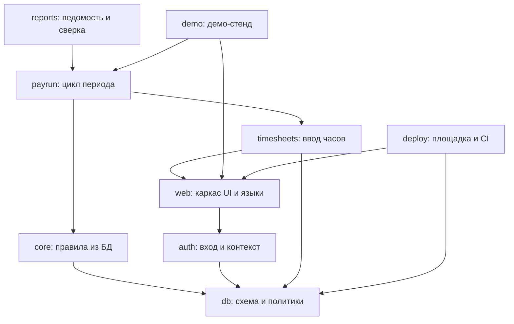

# Технический план

**Проект:** dodo_pnl_service — зарплатный модуль
**Дата:** 2026-08-06

Обоснования решений со ссылками на первоисточники — в
[research-report.md](research-report.md); сами решения с датами — в
[decisions.md](decisions.md).

---

## Стек с обоснованием

| Что | Выбор | Почему |
|---|---|---|
| Язык | Python 3.13 | 3.11 и 3.12 уже security-only. Django 6.1 требует 3.12+ |
| Веб и API | Django 6.1 → 6.2 LTS в 2027 | Админка справочников, мультиязычность, вход с ролями — готовы; у FastAPI и Litestar нет ни одного из трёх. `ATOMIC_REQUESTS` даёт транзакцию на запрос, без которой контекст тенанта не выставить безопасно |
| Интерфейс | Django-шаблоны + htmx 2.x, островок на табеле | 95% экранов — формы и ведомости. SPA удваивает кодовую базу и обесценивает причину выбора Django |
| Грид табеля | сначала обычные поля + Alpine.js; Tabulator (MIT), если упрёмся | У Tabulator буфер обмена, диапазоны, отмена и валидация в бесплатной части. Handsontable платный, у AG Grid это enterprise |
| БД | PostgreSQL 17 (`pgvector/pgvector:pg17` из шаблона сервера) | Образ уже используется на площадке. Темпоральные ограничения из 18 заменяются `btree_gist` + `EXCLUDE` |
| Драйвер | psycopg 3, синхронно | Расчёт CPU-bound, от async ничего не выигрывает, а тесты и импортёры дорожают |
| Миграции | миграции Django, политики и функции через `RunSQL` | Ни одна SQL-миграция не применена, истории нет, `0003` всё равно переписывается: переезд стоит одного переписывания |
| Вход | Django auth, за узким интерфейсом получения пользователя | Внешний сервер идентичности требует больше ресурсов, чем весь продукт; права всё равно живут у нас, потому что от них зависят политики |
| Разграничение доступа | Postgres RLS, ограничивающие политики | Единственный источник истины о доступе; забытый фильтр даёт пустоту, а не утечку |
| Фон | очередь на самом Postgres (`django-q2`) | Задач единицы в день; транзакционность даром, лишний брокер на домашнем сервере — лишний контур обновлений |
| Движок расчёта | остаётся как есть: чистый Python, Decimal, без ORM | Работает, покрыт тестами, сходится с эталоном. Django его вызывает, но не переписывает |
| Развёртывание | Docker Compose из `C:\projects\_template`, порты 8030 (API) и 5440 (БД) | Существующий Supabase на сервере занят staging Swarm Brain |

Отклонено и почему: Supabase (площадка своя, облако не нужно, `auth.uid()` уходит),
Keycloak и authentik (2 ядра и 2 ГБ плюс свои Postgres и Redis), Celery (лишний брокер),
FastAPI-Users (в maintenance mode), Handsontable (платная лицензия), C-расширения
темпоральности (своя сборка образа под Windows).

---

## Архитектура

```
                     браузер (шаблоны + htmx, ru/en/sr)
                                 │
                    ┌────────────┴────────────┐
                    │      Django 6.1         │
                    │  ┌───────────────────┐  │
                    │  │ вход, роли,       │  │
                    │  │ контекст тенанта  │  │  ← middleware выставляет
                    │  └─────────┬─────────┘  │    app.tenant_id и app.user_id
                    │            │            │    внутри транзакции запроса
                    │  ┌─────────┴─────────┐  │
                    │  │ табель · период · │  │
                    │  │ ведомость · отчёты│  │
                    │  └─────────┬─────────┘  │
                    │            │            │
                    │  ┌─────────┴─────────┐  │
                    │  │ payroll (чистый   │  │  ← существующий движок,
                    │  │ Python, Decimal)  │  │    правила приходят из БД
                    │  └───────────────────┘  │
                    └────────────┬────────────┘
                                 │ psycopg3, роль app_user без BYPASSRLS
                    ┌────────────┴────────────┐
                    │    PostgreSQL 17        │
                    │  RLS: тенант + регистр  │
                    └─────────────────────────┘
```

Ключевая механика, на которой держится безопасность: каждый HTTP-запрос обёрнут в
транзакцию, в начале которой выставляется контекст пользователя через
`set_config(..., true)`. Настройка живёт только до конца транзакции, поэтому утечка
контекста между запросами через пул соединений невозможна по построению, а не по
дисциплине разработчика. Приложение ходит ролью без права обходить политики.

Правила расчёта переезжают из YAML в таблицы `rule_presets` и `rule_overrides` с
датами действия. Движок получает на вход собранный на дату пресет и остаётся не
знающим ни про Сербию, ни про базу.

---

## Блоки и граф зависимостей

| Блок | О чём | Файл |
|---|---|---|
| `db` | схема, миграции, политики доступа, роли БД, переименование регистров | [blocks/db.md](blocks/db.md) |
| `core` | правила из БД, сборка пресета на дату, след расчёта | [blocks/core.md](blocks/core.md) |
| `auth` | вход, роли, членства, контекст тенанта в запросе | [blocks/auth.md](blocks/auth.md) |
| `web` | каркас интерфейса, шаблоны, htmx, локализация ru/en/sr | [blocks/web.md](blocks/web.md) |
| `timesheets` | ввод часов сеткой, импорт таблиц партнёра, валидация | [blocks/timesheets.md](blocks/timesheets.md) |
| `payrun` | цикл периода: расчёт, утверждение, откат, блокировки, ретро-дельта | [blocks/payrun.md](blocks/payrun.md) |
| `reports` | ведомость, след расчёта, отчёт расхождений, сверка, выгрузки | [blocks/reports.md](blocks/reports.md) |
| `demo` | демо-стенд: генератор данных, сброс из шаблона | [blocks/demo.md](blocks/demo.md) |
| `deploy` | compose, запуск на MUSPELHEIM, CI на PR | [blocks/deploy.md](blocks/deploy.md) |

Блоки, появившиеся после первой версии плана. Они не были предусмотрены здесь —
план писался под зарплатный модуль, а продукт вырос шире; журналы у них велись,
а таблица про них не знала, и это расхождение вскрылось 28.08.2026, когда
владелец спросил, почему стройка не идёт агентами (диспетчер читает **этот**
список):

| Блок | О чём | Файл |
|---|---|---|
| `facts` | центральная таблица фактов и сборка P&L | [blocks/facts.md](blocks/facts.md) |
| `money` | наличные, касса, расходы точек, деньги по человеку | [blocks/money.md](blocks/money.md) |
| `suppliers` | счета и платежи поставщикам, инбокс классификации, бумаги с точек | [blocks/suppliers.md](blocks/suppliers.md) |
| `hr` | кадры: заведение человека, условия найма, должности | [blocks/hr.md](blocks/hr.md) |
| `rules` | правила страны: реестр, уровни переопределения, рамки | [blocks/rules.md](blocks/rules.md) |
| `roles` | модель доступа: несколько ролей у человека, экран ролей и прав | [blocks/roles.md](blocks/roles.md) |
| `visual` | **дизайн-система в продукте**: токены, компоненты, плотность, тёмная тема | [blocks/visual.md](blocks/visual.md) |
| `guide` | продукт объясняет себя: гайд, онбординг, материалы для людей | [blocks/guide.md](blocks/guide.md) |
| `stands` | стенды и доставка формы ролей до поднятой базы | [blocks/stands.md](blocks/stands.md) |
| `hygiene` | техдолг и хозяйство стройки | [blocks/hygiene.md](blocks/hygiene.md) |
| `polish` | накопившиеся дефекты интерфейса, найденные другими блоками | [blocks/polish.md](blocks/polish.md) |


Журналы сверок со спекой (`converge6`, `converge7`, `converge8`) лежат отдельно —
[converge/](converge/): это ревизии свежим взглядом, а не блоки продукта. В
`blocks/` они мешали проверке целостности: у объявленного блока должны быть
задачи в графе, а у ревизии их нет и не может быть.

**`visual` — особый блок, и это не оформительская мелочь.** Дизайн-система
пришла после того, как стройка по спеке закончилась, и стала источником истины
о том, что должно быть на экране (решение владельца 27.08.2026). Спека этого не
знает: она описывает поведение зарплатного модуля. Поэтому задача, которая
рисует экран, сверяется не со спекой, а с модулем эталона — и в тексте задачи
модуль назван прямо. Что чему соответствует — [../product-map.md](../product-map.md).



---

## Очереди стройки

Строим не блоками целиком, а вертикальными срезами: после каждой очереди продукт
работает, и наступает пауза — посмотреть результат и решить, идти ли дальше.
Так лимиты сессий тратятся порциями и остаются на обычную работу.

**До готового MVP настоящая таблица партнёра не загружается вообще** (D028). Сид —
32 выдуманных человека из `tests/fixtures/plata-sample.xlsx`. Загрузка реальных
данных — приёмочный шаг в конце, а не инструмент по ходу.

| Очередь | Задачи | Результат на выходе |
|---|---|---|
| 1. Сквозной скелет | T008, T009, T035, вход упрощённый, сид тестовых, расчёт и ведомость в минимальном виде | Месяц считается в браузере на тестовых данных. Правила ещё из YAML, роль одна, оформления нет |
| 2. Правила и роли | T010–T015, T001–T004, T019 | Правила в базе с версиями, четыре роли, изоляция регистров починена, часы вводятся сеткой |
| 3. Доверие и цикл | T020–T032 | Утверждение с откатом, блокировки, след расчёта, сверка, отчёт расхождений, выгрузки |
| 4. Обвязка | T016–T018, T033, T034, T036, T037 | Демо, три языка, развёртывание на сервер, CI |

Оценка: 8–10 ч, 8–11 ч, 10–13 ч, 5–7 ч машинного времени соответственно. Это
предположение по объёму, а не расчёт: после первой очереди пересчитать.

**Четыре очереди выше — это MVP зарплатного модуля, и он пройден.** Дальше
продукт растёт по другой карте: очередями продуктовой карты (`CLAUDE.md`,
«Порядок работ») и модулями эталона. Задачи с T161 и дальше живут по ней, а не
по таблице выше — она оставлена как история, а не как план.

## Контракты между блоками

**`db` → всем.** Схема как источник истины. Наружу отдаёт:

- таблицы тенантов, точек, сотрудников, групп, календарей, пресетов и переопределений
  правил, табелей, периодов, ведомостей, компонентов выплаты;
- функции контекста: `app_user_id()`, `app_tenant_ids()`, `app_visible_ledgers(tenant)`;
- гарантию: любая выборка без выставленного контекста возвращает ноль строк.

**`auth` → `web`, всем представлениям.** Отдаёт объект текущего пользователя:

```python
get_current_principal() -> Principal
# Principal: user_id: UUID, tenant_id: UUID, unit_ids: list[UUID],
#            visible_ledgers: list[str], permissions: list[str]
```

Плюс middleware, которое до любого обращения к данным выставляет контекст в транзакции
запроса. Контракт жёсткий: представление никогда не фильтрует по тенанту само.

**`core` → `payrun`.** Движок и сборка правил:

```python
load_preset_at(tenant_id: UUID, country: str, on_date: date) -> Preset
    # собирает пресет из rule_presets и rule_overrides по слоям
    # страна → партнёр → группа → сотрудник, на конкретную дату

PayrollEngine(preset).calculate(employee: Employee, timesheet: Timesheet) -> Payslip
    # существующая сигнатура, не меняется

explain(employee, timesheet, preset) -> list[TraceStep]
    # TraceStep: rule_code, input_values, applied_value, rule_version_id
```

**`timesheets` → `payrun`.** Часы за период в виде, который принимает движок:

```python
timesheet_for(employee_id: UUID, period: date) -> Timesheet
    # hours по типам, insured_hours, norm_hours; собирается из подневного хранения
import_partner_table(file, tenant_id, period) -> ImportResult
    # ImportResult: matched, unmatched_rows, warnings — идемпотентно по dedup_key
```

**`payrun` → `reports`.** Результат расчёта и состояние периода:

```
GET  /api/periods/{period}/payslips   -> ведомость по видимым регистрам
GET  /api/payslips/{id}/trace         -> след расчёта строки
POST /api/periods/{period}/calculate  -> запуск расчёта (фоновая задача)
POST /api/periods/{period}/approve    -> утверждение
POST /api/periods/{period}/reopen     -> откат, тело: {reason: str} — обязательное
POST /api/units/{unit}/close          -> закрытие точки
```

Инвариант, который `reports` может считать данностью: итоги приходят уже посчитанными
по видимому срезу регистров — маскировать на выводе ничего не нужно.

**`demo` → `deploy`.** Команда наполнения и сброса:

```
manage.py seed_demo --reset   # пересоздаёт демо-базу из шаблона и наполняет
```

**`deploy` → всем.** Переменные окружения (имена, не значения):
`DATABASE_URL`, `APP_PORT`, `POSTGRES_HOST_PORT`, `SECRET_KEY`, `DJANGO_SETTINGS_MODULE`,
`DEMO_DATABASE_URL`, `PAYROLL_FIXTURE` (локальный путь к эталонной таблице, только у
владельца).

---

## Риски

| Риск | Смягчение |
|---|---|
| Переезд схемы на миграции Django ломает уже работающий расчёт | Регрессионный тест июня 2026 гоняется на каждом шаге; движок не трогаем вовсе, меняется только источник правил |
| Политики доступа написаны, но не применяются (владелец обходит RLS) | Тесты изоляции обязаны гоняться не-владельцем; `force row level security` включается в той же миграции, что политика. Уже проверено на живой базе — дефект был именно такой |
| Правила из YAML при переносе в БД разъезжаются с эталоном | Перенос считается сделанным, только когда расчёт из БД даёт то же, что расчёт из YAML, на всех 30 сотрудниках |
| Импорт таблицы партнёра ломается на следующем месяце — формат «плывёт» | Импортёр не доверяет структуре: неизвестные листы и колонки не молчат, а попадают в отчёт импорта; тест на испорченный файл обязателен |
| Домашний сервер выключается, продукт недоступен | Для MVP допустимо: живых пользователей нет. Данные бэкапятся существующей задачей сервера; перенос на другую площадку — решение владельца позже |
| Персональные данные утекают в открытый репозиторий | История чистится до первого push; фикстура генерируется; проверка на секреты и данные — часть гейта |
| Второе окно снова начнёт писать в те же файлы | Работа над другими модулями — в отдельном worktree и ветке; в этой папке идёт только зарплатный модуль |
| Django 6.1 и `django-q2` могут не дружить с RLS-контекстом в фоновых задачах | Проверить смоуком в первом же спринте блока `payrun`: фоновая задача обязана выставлять контекст сама, у неё нет HTTP-запроса |
